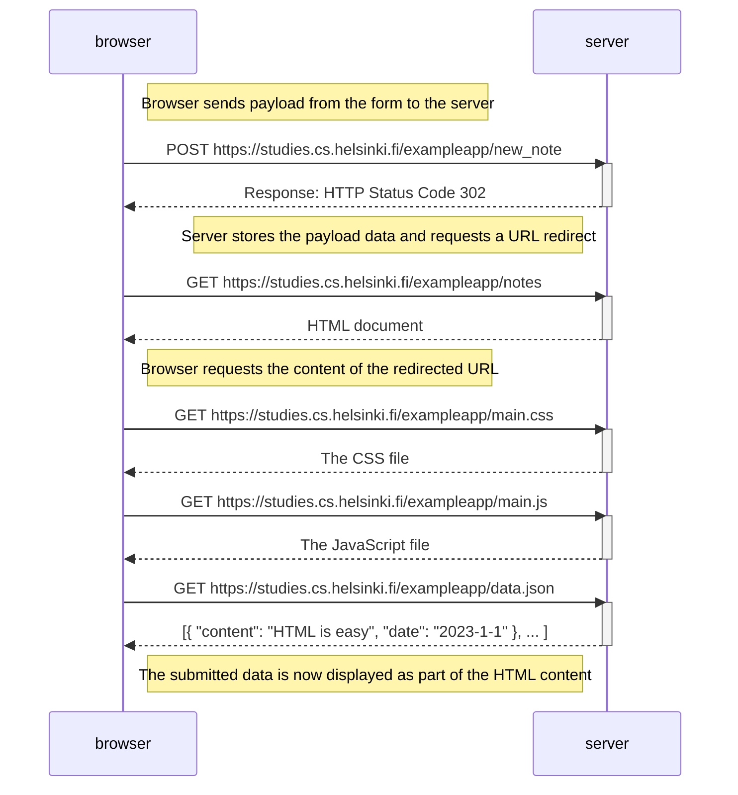

```mermaid
sequenceDiagram
  participant browser
  participant server

  Note right of browser: Browser sends payload from the form to the server

  browser->>server: POST https://studies.cs.helsinki.fi/exampleapp/new_note
  activate server
  server-->>browser: Response: HTTP Status Code 302
  deactivate server

  Note left of server: Server stores the payload data and requests a URL redirect

  browser->>server: GET https://studies.cs.helsinki.fi/exampleapp/notes
  activate server
  server-->>browser: HTML document
  deactivate server

  Note right of browser: Browser requests the content of the redirected URL

  browser->>server: GET https://studies.cs.helsinki.fi/exampleapp/main.css
  activate server
  server-->>browser: The CSS file
  deactivate server

  browser->>server: GET https://studies.cs.helsinki.fi/exampleapp/main.js
  activate server
  server-->>browser: The JavaScript file
  deactivate server

  browser->>server: GET https://studies.cs.helsinki.fi/exampleapp/data.json
  activate server
  server-->>browser: [{ "content": "HTML is easy", "date": "2023-1-1" }, ... ]
  deactivate server

  Note right of browser: The submitted data is now displayed as part of the HTML content
```