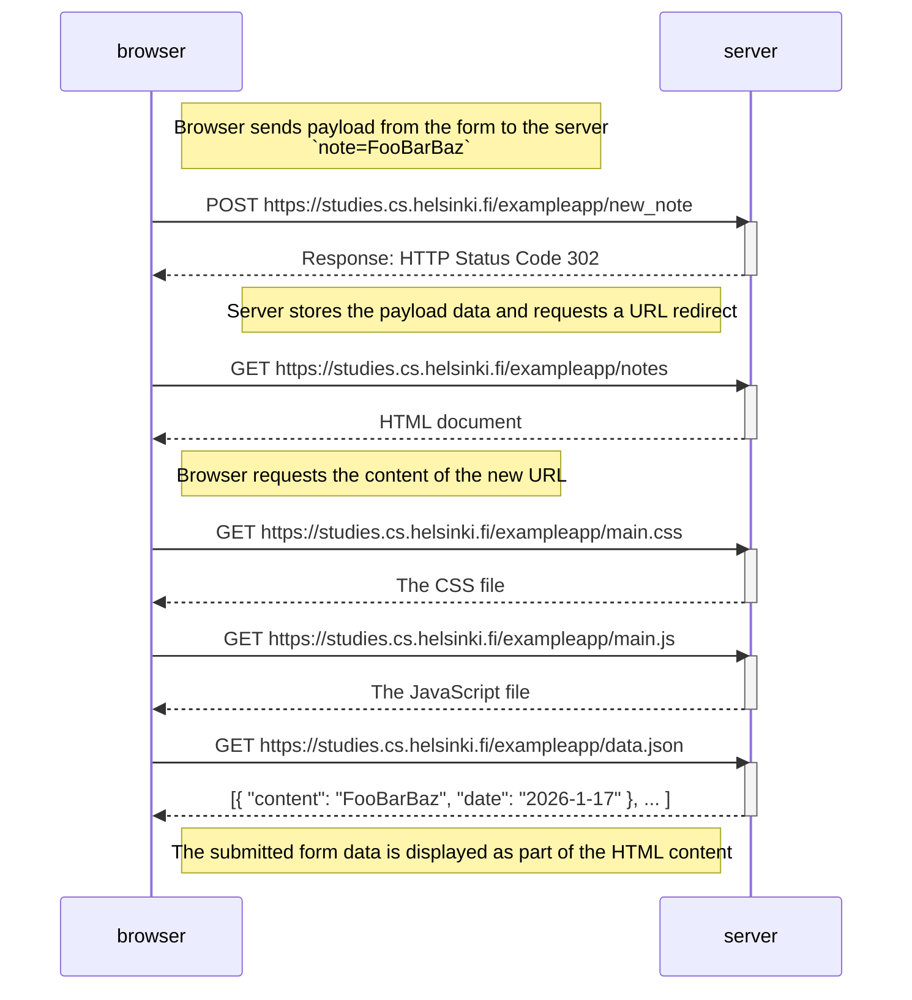

# New Note Diagram

Sequence occurring when a new note form is submitted.

Reference: https://studies.cs.helsinki.fi/exampleapp/notes

```mermaid
sequenceDiagram
  participant browser
  participant server

  Note right of browser: Browser sends payload from the form to the server<br/>`note=FooBarBaz`

  browser->>server: POST https://studies.cs.helsinki.fi/exampleapp/new_note
  activate server
  server-->>browser: Response: HTTP Status Code 302
  deactivate server

  Note left of server: Server stores the payload data and requests a URL redirect

  browser->>server: GET https://studies.cs.helsinki.fi/exampleapp/notes
  activate server
  server-->>browser: HTML document
  deactivate server

  Note right of browser: Browser requests the content of the new URL

  browser->>server: GET https://studies.cs.helsinki.fi/exampleapp/main.css
  activate server
  server-->>browser: The CSS file
  deactivate server

  browser->>server: GET https://studies.cs.helsinki.fi/exampleapp/main.js
  activate server
  server-->>browser: The JavaScript file
  deactivate server

  browser->>server: GET https://studies.cs.helsinki.fi/exampleapp/data.json
  activate server
  server-->>browser: [{ "content": "FooBarBaz", "date": "2026-1-17" }, ... ]
  deactivate server

  Note right of browser: The submitted form data is displayed as part of the HTML content
```
