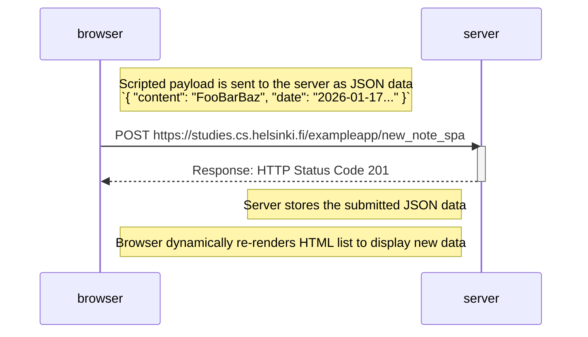

# New Note in Single Page App Diagram

Sequence occurring when a new note is submitted in a single page application.

Reference: https://studies.cs.helsinki.fi/exampleapp/spa

```mermaid
sequenceDiagram
  participant browser
  participant server

  Note right of browser: Scripted payload is sent to the server as JSON data<br/>`{ "content": "FooBarBaz", "date": "2026-01-17..." }`

  browser->>server: POST https://studies.cs.helsinki.fi/exampleapp/new_note_spa
  activate server
  server-->>browser: Response: HTTP Status Code 201
  deactivate server

  Note left of server: Server stores the submitted JSON data

  Note right of browser: Browser dynamically re-renders HTML list to display new data
```
